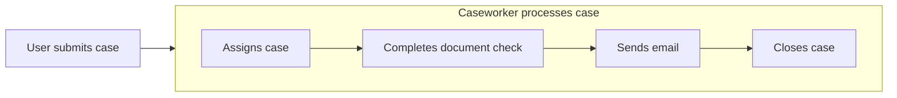

# Scenario Builder

A framework for implementing complex test scenario setup using the builder pattern.

## Table of contents

- [Scenario Builder](#scenario-builder)
  - [Table of contents](#table-of-contents)
  - [Introduction](#introduction)
  - [Example](#example)
    - [Incremental](#incremental)
  - [Installation](#installation)
  - [Usage](#usage)
    - [Scenarios](#scenarios)
      - [Defining scenario events](#defining-scenario-events)
      - [Builder](#builder)
    - [Events](#events)
      - [Builder](#builder-1)
    - [Composite events](#composite-events)
      - [Defining child events](#defining-child-events)
      - [Builder](#builder-2)
  - [Contributing](#contributing)

## Introduction

The scenario builder provides an intuitive test setup experience that can be shared across multiple automated test suites. It uses the [builder](https://refactoring.guru/design-patterns/builder) pattern to ensure that tests are only concerned with what is relevant to them.

The scenario builder can help you improve test automation productivity through greater code reuse and abstraction as well as a fluent and discoverable interface.

## Example

Imagine a simple case management application where an end-to-end scenario looks like this:



The automated tests for this application will need to setup scenarios up to any given point in that process. In addition, they will need to configure the specific parameters of each of those events. The scenario builder provides a framework for achieving both of those goals. 

A scenario with a completely processed case:

```csharp
var scenario = await this.scenarioBuilder
    .CaseworkerProcessesCase()
    .BuildAsync();
```

A scenario with a case that has been processed as far as the documents check (which is missing documents):

```csharp
var scenario = await this.scenarioBuilder
    .CaseworkerProcessesCase(a => a
        .ByCompletingDocumentsCheck(b => b
            .WithOutcome(DocumentsCheckOutcome.MissingDocuments))
        .AndAllPreviousSteps())
    .BuildAsync();
```

The test only has to specify as much detail as is relevant. Any preceding events (e.g. the case submission and assignment) will be executed implicitly as dependencies - this abstraction of the process means that a mass refactor of tests is not required if process changes are introduced. 

The scenario builder returns a `scenario` object that can be to perform further actions and assertions on any data generated by the builder. It captures selected outputs from the events (such as the case ID from the case submission event).

### Incremental

The `scenario` object can also be used to build incrementally via multiple calls to `BuildAsync`. This is particularly useful when using [SpecFlow](https://specflow.org/), as test setup is typically split over multiple methods. 

Below is an example SpecFlow scenerio which is scenario building incrementally:

```gherkin
Given a case has been assigned to me
And I have completed the documents check with an outcome of 'missing documents'
```

Below is the implementation of those bindings:

```csharp
[Given("a case has been assigned to me")]
public void GivenACaseHasBeenAssignedToMe()
{
    var scenario = this.scenarioBuilder.
        .CaseworkerProcessesCase(a => a
            .ByAssigningTheCase(b => b
                .WithAssignee(GetLoggedInUserId()))
        .BuildAsync()
        
    this.ctx.Set(scenario, "scenario");
}
```

```csharp
[Given("I have completed the documents check")]
public void GivenIHaveCompletedTheDocumentsCheck()
{
    var scenario = this.ctx.Get<MyScenario>("scenario");

    this.scenarioBuilder.
        .CaseworkerProcessesCase(a => a
            .ByCompletingDocumentsCheck()
        .BuildAsync(scenario);
}
```

Events that have already executed are not executed again and events that are yet to execute will be provided with the context generated by the previous call(s) to `BuildAsync`.

## Installation

Install the `ScenarioBuilder` NuGet package:

```shell
dotnet add package ScenarioBuilder
```

## Usage

To implement a scenario builder:

- Create one or more concrete `Event` class and nested `Builder<TEvent>`
- Create zero or more concrete `CompositeEvent` classes and nested `Builder<TCompositeEvent>` classes
- Create a concrete `Scenario` class and nested `Builder<TScenario>`
- Declare the event order on your scenario and composite events using the `ComposeUsing` attributes

### Scenarios

Scenarios define the events that execute and the outputs returned to the caller. Scenarios must inherit from the `Scenario` class. 

The below example shows a `CaseScenario` class used for an example case management system. A case submission event has been declared (through the `ComposeUsing` attribute), the case ID output (through the `CaseId` property), and the associated builder. Note that all scenario outputs should be nullable types as not all events will always run.

```csharp
/// <summary>
/// An example scenario for a case.
/// </summary>
[ComposeUsing(0, EventIds.CaseSubmission, typeof(UserSubmitsCaseEvent))]
public class CaseScenario : Scenario
{
    /// <summary>
    /// Gets the case submission info.
    /// </summary>
    public Guid? CaseId { get; internal set; }

    /// <summary>
    /// The event IDs for the events within the <see cref="CaseScenario"/>.
    /// </summary>
    public static class EventIds
    {
        /// <summary>
        /// The event ID of the case submission event.
        /// </summary>
        public const string CaseSubmission = nameof(CaseSubmission);
    }
}
```

#### Defining scenario events

Define the events that occur as part of a scenario by decorating the scenario class with `[ComposeUsing]` attributes. These attributes store the following about the event:

- Execution order
- ID
- Type
- Compile-time constructor arguments (optional)

In the example above, the `UserSubmitsCaseEvent` event is the first event that executes (as order is `0`). It has an ID assigned from the `EventIds.CaseSubmission` constant. It is recommended to assign these IDs to constants in a nested class within the scenario, as they will be referred to again when configuring the scenario builder.

```csharp
[ComposeUsing(0, EventIds.CaseSubmission, typeof(UserSubmitsCaseEvent))]
```

#### Builder

Scenario builders defines the interface for how scenarios are configured. 

The scenario builder class is the entry-point to building scenarios. This is where the methods are defined that will allow the events (added with the `[ComposeUsing]` attributes) be configured. Implement a scenario builder by creating a nested class within the event which extends the `Builder<TScenario>` class:

```csharp
    /// <summary>
    /// A builder for the <see cref="CaseScenario"/>.
    /// </summary>
    /// <param name="clientFactory">A client factory.</param>
    public class Builder(IServiceClientFactory clientFactory) : Builder<CaseScenario>
    {
        private readonly IServiceClientFactory clientFactory = clientFactory;

        /// <summary>
        /// Configures the portal user submitting a case event.
        /// </summary>
        /// <param name="configurator">The configurator.</param>
        /// <returns>The builder.</returns>
        public Builder UserSubmitsCase(Action<UserSubmitsCaseEvent.Builder>? configurator = null)
        {
            this.ConfigureEvent<UserSubmitsCaseEvent, UserSubmitsCaseEvent.Builder>(EventIds.CaseSubmission, configurator);

            return this;
        }

        /// <inheritdoc/>
        protected override IServiceCollection InitializeServices(ServiceCollection serviceCollection)
        {
            return serviceCollection.AddSingleton(this.clientFactory);
        }
    }
```

Each event (e.g. `UserSubmitsCaseEvent`) needs a corresponding builder method (e.g. `UserSubmitsCase`). These methods are boilerplate and will always resemble the above - a call to `this.ConfigureEvent` and `return this;`. The only thing that will change between these methods is the name of the method, the event ID, and the types of the event and event builder classes. Note that the `configurator` parameter should always be optional and defaulted to `null`.

The builder is where any services that events are dependent on can be registered by overriding the `InitializeServices` method. These services will be injected into events when they are added to the event constructor parameters. Below shows the `IServiceClientFactory` service that was added to the builder constructor parameters being registered.

```csharp
protected override IServiceCollection InitializeServices(ServiceCollection serviceCollection)
{
    return serviceCollection
        .AddSingleton(this.clientFactory);
}
```

### Events

Events are the implementation of an actor performing an action. The naming convention is typically `SubjectVerbObjectEvent` (e.g. `UserSubmitsCaseEvent`).

Implement an event by extending the abstract `Event` and providing an implementation for the `ExecuteAsync` method. Events should read the `context` to get data captured by preceding events and they should also add anything to the context which may be required by later events. Events should always result in a valid outcome unless explicitly configured via their builder.

```csharp
/// <summary>
/// An event for a user submitting an case.
/// </summary>
/// <param name="eventId">The event ID.</param>
/// <param name="clientFactory">The client factory.</param>
/// <param name="logger">The logger</param>
public class UserSubmitsCaseEvent(string eventId, IServiceClientFactory clientFactory, ILogger<UserSubmitsCaseEvent> logger)
    : Event(eventId)
{
    private readonly IServiceClientFactory clientFactory = clientFactory;
    private readonly ILogger<UserSubmitsCaseEvent> logger = logger;
    private readonly CaseFaker caseFaker = new CaseFaker();

    /// <inheritdoc/>
    public async override Task ExecuteAsync(ScenarioContext context)
    {
        this.logger.LogInformation($"Submitting a case.");

        using var client = this.clientFactory.GetServiceClient(Persona.User);
        var caseId = await client.CreateAsync(caseFaker.Generate());

        this.logger.LogInformation($"Created case {caseId}.");

        context.Set("CaseId", caseId);
    }
}
```

Events will have at least one constructor parameter of `eventId`, but you can add additional parameters for any services your events are dependent on (these are then resolved from the services registered in the scenario builder). You can also make reusable events configurable at compile-time with constructor arguments supplied by the `ComposeUsing` attributes. These constructor arguments must appear at the beginning of the event constructor.

#### Builder

Event builders define the interface for how events are configured. 

Implement an event builder by creating a nested class within the event which extends the `Builder<TEvent>` class. All event builders will need to define the same constructor parameters which are passed to the base constructor.

In the above example, the `CaseFaker` could be configurable. An example builder is shown below which allows the `CaseFaker` field to be overridden. To do this, a builder method is defined which assigns to a field with the same name and type of a corresponding field in the event. These fields should be private. The value will automatically be mapped. The naming convention for event builder methods is to start with `With`.

```csharp
/// <summary>
/// A builder for the <see cref="UserSubmitsCaseEvent"/> event.
/// </summary>
/// <param name="eventFactory">The event factory.</param>
/// <param name="eventId">The event ID.</param>
/// <param name="constructorArgs">The constructor args.</param>
public class Builder(EventFactory eventFactory, string eventId, object[]? constructorArgs = null)
    : Builder<UserSubmitsCaseEvent>(eventFactory, eventId, constructorArgs)
{
    private CaseFaker caseFaker;

    public Builder WithCase(CaseFaker caseFaker)
    {
        this.caseFaker = caseFaker;

        return this;
    }
}
```

Note that the possibility that the builder fields have not been explicitly configured must always be handeld i.e. default values must be in place. This can be seen in the updated event below:

```csharp
private CaseFaker caseFaker;

/// <inheritdoc/>
public async override Task ExecuteAsync(ScenarioContext context)
{
    this.logger.LogInformation($"Submitting a case.");

    using var client = this.clientFactory.GetServiceClient(Persona.User);
    var caseId = await client.CreateAsync((this.caseFaker ?? new CaseFaker()).Generate());

    this.logger.LogInformation($"Created case {caseId}.");

    context.Set("CaseId", caseId);
}
```

### Composite events

Composite events are special kinds of events which are comprised of other events. They enable layers of abstraction as well as fine-grained control over what events execute. The naming convention is the same as standard events. It is preferable to use verbs such as `Processes` rather than `Completes` due to the configurable nature of these events.

In the example below, the caseworker processing a case is a composite event. If a fully processed case is needed then there is no need to configure the composite event via the builder:

```csharp
this.scenarioBuilder
    .CaseworkerProcessesCase()
    .BuildAsync();
```

However, if a partially processed case (or a case processed with specific parameters) is needed then it is possible to drill-down and configure the events within the composite:

```csharp
this.scenarioBuilder
    .CaseworkerProcessesCase(a => a
        .ByCompletingDocumentsCheck(b => b
            .WithOutcome(DocumentsCheckOutcome.MissingDocuments))
        .AndAllPreviousSteps())
    .BuildAsync();
```

There are two methods on the composite event builders that are implemented by default: `AndAllPreviousSteps()` and `AllAllOtherSteps()`. Unlike the builder at the scenario level (which runs all previous steps when you configure an event), the composite events will run only the configured events by default unless you use one of those two methods.

#### Defining child events

Defining child events on a composite event is exactly the same as defining events on a scenario. You simply use the `[ComposeUsing]` attribute on your composite event class.

In the example below, the `CaseworkerProcessesCaseEvent` composite event is composed using the `CaseworkerAssignsCaseEvent` and the `CaseworkerCompletesDocumentCheckEvent`.

```csharp
/// <summary>
/// A composite event for a caseworker processing a case.
/// </summary>
[ComposeUsing(0, EventIds.CaseAssignment, typeof(CaseworkerAssignsCaseEvent))]
[ComposeUsing(1, EventIds.CaseDocumentCheck, typeof(CaseworkerCompletesDocumentCheckEvent))]
public class CaseworkerProcessesCaseEvent : CompositeEvent
{
    /// <summary>
    /// Initializes a new instance of the <see cref="CaseworkerProcessesCaseEvent"/> class.
    /// </summary>
    /// <param name="eventsFactory">The event factory.</param>
    /// <param name="eventId">The ID of the event.</param>
    public CaseworkerProcessesCaseEvent(EventFactory eventsFactory, string eventId)
        : base(eventsFactory, eventId)
    {
    }

    /// <summary>
    /// The IDs for the events within the <see cref="CaseworkerProcessesCaseEvent"/> event.
    /// </summary>
    public static class EventIds
    {
        /// <summary>
        /// The event ID of the case assignment event.
        /// </summary>
        public const string CaseAssignment = nameof(CaseAssignment);

        /// <summary>
        /// The event ID of the case document check event.
        /// </summary>
        public const string CaseDocumentCheck = nameof(CaseDocumentCheck);
    }

```

#### Builder

Composite event builders define the interface for how composite events are configured. 

This is the same process as detailed in the [Defining scenario events](#defining-scenario-events) section. The convention is to start the builder method names with `By`.

```csharp
/// <summary>
/// A builder for the <see cref="CaseworkerProcessesCaseEvent"/>.
/// </summary>
public class Builder : Builder<CaseworkerProcessesCaseEvent>
{
    /// <summary>
    /// Initializes a new instance of the <see cref="Builder"/> class.
    /// </summary>
    /// <param name="eventBuilderFactory">The event builder factory.</param>
    /// <param name="eventFactory">The event factory.</param>
    /// <param name="eventId">The ID of the event.</param>
    public Builder(EventBuilderFactory eventBuilderFactory, EventFactory eventFactory, string eventId)
        : base(eventBuilderFactory, eventFactory, eventId)
    {
    }

    /// <summary>
    /// Configures the assigning of the Case.
    /// </summary>
    /// <param name="configurator">The configurator.</param>
    /// <returns>The builder.</returns>
    public Builder ByAssigningTheCase(Action<CaseworkerAssignsCaseEvent.Builder>? configurator = null)
    {
        this.ConfigureEvent<CaseworkerAssignsCaseEvent, CaseworkerAssignsCaseEvent.Builder>(EventIds.CaseAssignment, configurator);

        return this;
    }

    /// <summary>
    /// Configures the setting of the Case approval.
    /// </summary>
    /// <param name="configurator">The configurator.</param>
    /// <returns>The builder.</returns>
    public Builder BySettingCaseApproval(Action<CaseworkerCompletesDocumentCheckEvent.Builder>? configurator = null)
    {
        this.ConfigureEvent<CaseworkerCompletesDocumentCheckEvent, CaseworkerCompletesDocumentCheckEvent.Builder>(EventIds.CaseDocumentCheck, configurator);

        return this;
    }
}
```

## Contributing

Refer to the [Contributing](./CONTRIBUTING.md) guide.